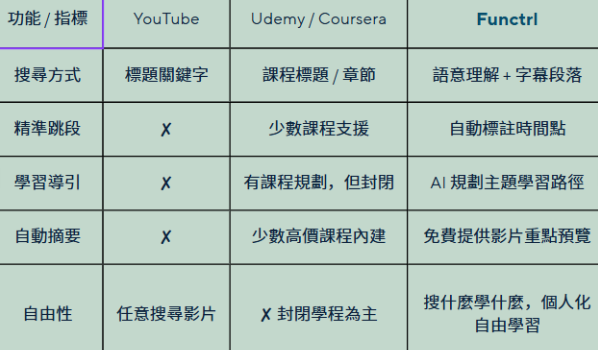

# FunCtrl

made by 楊博仁、林祐霆、曾芸儀、蔡佳祐、梁修瑜

## 1. 介紹

Functrl 是一個方便且優秀的智慧學習平台，不只可以幫助用戶精準的找到想學習的特定影片，還結合了各種 AI 輔助功能，讓用戶能夠有條理的規劃學習地圖，讓使用者在面對龐大的公開影片資料時，能更有效率、有計畫性的的學習知識。

## 2. 功能介紹

FunCtrl 的設計宗旨是協助學習者在龐大的影片資源中快速定位知識，並結合人工智慧提供結構化的學習體驗。系統主要具備以下功能：

1. **語意向量搜尋和精準知識定位**：學習者輸入查詢（query）後，系統會透過 Semantic Vector Search 與 Gemini 擴張同義詞技術，將查詢與影片的標題、標籤及字幕進行比對。FunCtrl 能從中精準定位相關的影片片段，並提供時間戳記，使用者可直接跳轉至所需知識的核心片段，大幅提升學習效率。

2. **影片自動下載與 AI 影片分析**：當向量檢索結果顯示影片與查詢之間的相似度分數偏低時，即代表資料庫中尚未收錄合適的資源。此時，系統將自動從 YouTube 下載相關影片，並透過 Gemini 模型進行內容解析。解析結果涵蓋影片標題摘要、時間戳段落摘要以及完整影片資訊。隨後，這些資料會轉換為向量並存入資料庫，以確保平台持續擴充，並能即時提供學習者最新且可用的知識資源。

3. **AI 學習地圖規劃**：針對學習主題，系統會自動生成三階段的學習地圖，涵蓋基礎、進階與應用三個層次。每個知識點皆對應到特定影片片段，協助學習者循序漸進、避免零碎吸收。透過此規劃，使用者能獲得一條清晰的學習路徑，而不必依靠零散的影片自行摸索。

4. **AI 測驗和 AI 互動問答**：在觀看影片後，學習者可立即使用由 Gemini Model 自動生成的測驗，並獲得詳解與錯題分析，快速檢視尚未熟悉的觀念。透過這樣的練習與回饋，學習者能逐步加深理解。同時，若在學習過程或答題後遇到疑問，也能隨時透過 AI 助手提問，獲得即時解答，讓學習不中斷。

5. 其他功能：除了核心 AI 功能外，FunCtrl 亦具備完整的學習平台基礎功能，包括：使用者登入與身分管理、影片收藏與分類、個人化首頁推薦、學習歷史紀錄查詢。

這些功能確保 FunCtrl 在滿足學習需求的同時，也能提供順暢、完整的使用體驗。

## 3. 系統特色

1. **精準搜尋知識**：
   - 現有平台：只能依靠標題或描述搜尋，學習者往往需要花大量時間快轉、倒轉才能找到重點
   - FunCtrl：以字幕與語意檢索為基礎，能直接定位至影片中的特定片段，快速帶領學習者掌握所需知識
2. **AI 規劃學習地圖**：
   - 現有平台：課程內容多為固定流程，缺乏彈性，學習者必須自行拼湊不同影片
   - FunCtrl：根據查詢動態生成三階段學習地圖，涵蓋基礎、進階與應用，並自動補足缺少的影片資源，提供清晰完整的學習路徑
3. **整合式學習體驗**：
   - 現有平台與工具：YouTube 提供影片、GPT 能回答問題、Notebook 能做筆記，但彼此分散，學習過程零碎
   - FunCtrl：將搜尋、學習地圖、測驗與互動問答整合在同一平台，讓學習更連貫、效率更高

## 4. 系統開發工具與技術

## 5. 系統使用對象

